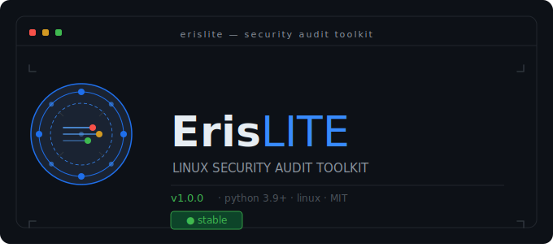

# ErisLITE

<p align="center">
  
</p>


*A modular Linux security monitoring toolkit for analysts, students and system administrators.*

ErisLITE is a standalone CLI tool for interactive security auditing on Linux hosts. Run threat sweeps, inspect system configuration, and review findings — no external dependencies or infrastructure required.

Designed for CCDC competitors, security students and sysadmins who need fast, readable triage output on a live system.

---

## Features

### Security Modules (14 total)

| Module | What it checks |
|--------|----------------|
| Network Listeners | Active TCP/UDP listeners with risk classification |
| Listener Check | Heuristic suspicious-listener detection |
| User Anomaly Scan | UID 0 clones, hidden accounts, bad shells |
| Login / Auth Logs | Failed logins, root shells, auth anomalies |
| Kernel Modules | Known-bad or untracked kernel modules |
| Cron & Timers | Suspicious scheduled tasks and systemd timers |
| CVE Version Check | Kernel / sudo / glibc version matches (offline) |
| SSH Keys | Enumerates `authorized_keys` across all users |
| SSH Config Audit | `sshd_config` settings against secure defaults |
| World-Writable | World-writable files and dirs in critical paths |
| SUID / SGID | Unexpected SUID/SGID binaries |
| Docker Security | Privileged containers and exposed sockets |
| Firewall Status | UFW / iptables presence and rule state |
| File Integrity | SHA-256 baseline check on critical system files |

### Additional Tools (v1.0.0)

| Tool | What it does |
|------|--------------|
| Backdoor Check | Inspects shell init files, profile.d, and LD_PRELOAD for persistence indicators |
| Hosts Check | Flags `/etc/hosts` entries that redirect critical domains or appear malicious |
| Process Check | Identifies root processes running from suspicious paths, deleted executables, or known bad tool names |
| Rapid Response | Triage scan with dry-run and live containment modes — see warning below |

### CLI
- Interactive menu system with section-grouped security tools
- Threat Sweep with `quick`, `standard`, and `full` profiles
- Risk scoring (0–100) with colour-coded results and threat insight panel
- System snapshot logging to `data/logs/`
- Sweep log viewer with previous result browsing
- SOC Mode: 15-minute rolling log snapshot

---

## Requirements

- Python 3.9+
- Linux (all security modules are Linux-only — Windows and macOS are not supported)
- `sudo` / root access recommended for full scan coverage

```bash
pip install -r requirements.txt
```

---

## Installation

```bash
git clone https://github.com/herrpeiper/ErisLITE.git
cd ErisLITE
pip install -r requirements.txt
```

---

## Usage

```bash
sudo python3 main.py
```

Typical workflow:
1. Launch ErisLITE
2. Select **Security Tools** from the main menu
3. Run individual checks or select **Run Threat Sweep**
4. Review findings and risk score
5. Open **View Recent Threat Sweeps** to review past results

---

## Project Structure

```
ErisLITE/
│
├── core/
│   ├── network_scan.py
│   ├── login_audit.py
│   ├── cve_checker.py
│   ├── security_audit.py
│   ├── user_profile.py
│   ├── log_viewer.py
│   ├── cve_tools.py
│   ├── system_info.py
│   ├── network_tools.py
│   ├── port_scan.py
│   └── version.py
│
├── tools/
│   ├── threat_sweep.py
│   ├── snapshot.py
│   ├── listener_check.py
│   ├── user_anomaly.py
│   ├── integrity_tools.py
│   ├── kernel_module_check.py
│   ├── ssh_key_check.py
│   ├── ssh_config_check.py
│   ├── world_writable_check.py
│   ├── cron_timer_check.py
│   ├── suid_check.py
│   ├── docker_check.py
│   ├── firewall_check.py
│   ├── backdoor_check.py       ← new in v1.0.0
│   ├── hosts_check.py          ← new in v1.0.0
│   ├── process_check.py        ← new in v1.0.0
│   └── rapid_response.py       ← new in v1.0.0
│
├── ui/
│   ├── cli.py
│   ├── splash.py
│   └── menus/
│       ├── security_menu.py
│       ├── network_menu.py
│       ├── system_menu.py
│       ├── cve_tools_menu.py
│       └── help_menu.py
│
├── infra/
│   └── systemd/
│       └── erislite-agent.service
│
├── data/
│   └── logs/
│
├── main.py
├── requirements.txt
└── README.md
```

---

## First Run Notes

**Integrity baseline** — the File Integrity module requires a baseline before it can detect changes. On first run, go to Security Tools → File Integrity Monitor → Create Integrity Baseline. The baseline is stored in `data/integrity/` and is gitignored by design.

**User profile** — `user_profile.json` is auto-generated on first launch and locked read-only. To suppress snapshot alerts for known users, add usernames to the `known_users` list in the profile. You will need to temporarily `chmod 644` it first.

**Root access** — some modules (kernel modules, world-writable scan, SUID scan, auth logs, process check) require root to return complete results. Run with `sudo` for full coverage.

**CVE version checker** — performs offline version matching only against known vulnerable version ranges for the kernel, sudo, and glibc. A match does not confirm a vulnerability. Vendors frequently backport patches without changing the base version number. Always verify findings against vendor advisories before taking action.

**Rapid Response live mode** — `rapid_response.py` includes a live containment mode that will actively modify system state (killing processes, modifying firewall rules, etc.). Always run in dry-run mode first to review planned actions before executing live. Understand what the tool will do before running it with root privileges.

---

## Development

ErisLITE is designed for modular extension. To add a new security module:

1. Create `tools/my_check.py` with a `run_my_check(silent=False)` function that returns `{"status": ..., "details": [...], "tags": [...]}`
2. Add it to `ui/menus/security_menu.py`
3. Add it to the `profiles` dict in `tools/threat_sweep.py`

---

## License

MIT License — see `LICENSE` for details.

---

## Author

Liam Piper-Brandon (Stackdefender)

---

## Disclaimer

ErisLITE is intended for use on systems you own or have explicit written authorisation to audit. Unauthorised use against systems you do not own or have permission to test is illegal and unethical. The author accepts no responsibility for misuse.

The CVE version checker performs offline version matching only. A version match does not confirm a vulnerability — vendors frequently backport patches without changing the base version number. Do not treat a match as a confirmed finding without verifying against vendor advisories.

`rapid_response.py` includes a live containment mode that actively modifies system state. Always use dry-run mode first. Running live containment without understanding its actions may disrupt services or cause unintended system changes. Use with caution and only on systems you are authorised to modify.

This software is provided as-is with no warranty of any kind. The author accepts no liability for damages, data loss, or service disruption resulting from its use.
